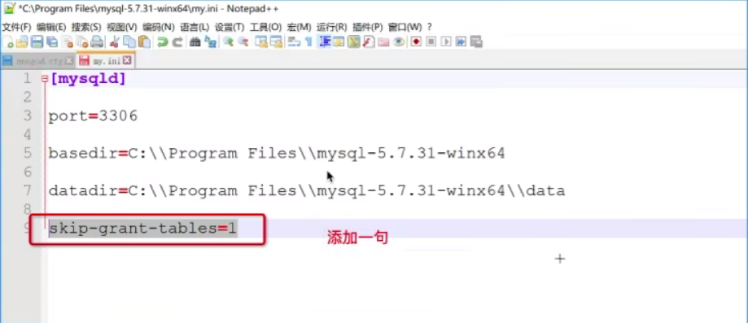
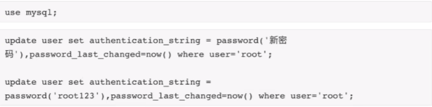

# Django

# 1. 初始网站

## 1.1 Web框架

浏览器输入url访问到网站函数，函数调用html模板与外部数据库返回到浏览器。


# 2. Mysql数据库

- mysql -u root -p

- 查看已有数据库

  ```
  show databases;
  ```

- 创建数据库

  ```
  create database 数据库名 CHARSET utf8;
  ```

- 删除数据库

  ```
  drop database 数据库名;
  ```

- 进入数据库

  ```
  use 数据库名;
  ```

- 查看所有数据表

  ```
  show tables;
  ```

- 创建表

  ```sql
  create table 表名称(
  	id int auto_increment primary key,	-- (自增)(主键)
  	name varchar(16) not null,			-- (不为空)
  	age int default 3					-- (默认值为3)
  )default charset=utf8;
  ```

- 删除表

  ```sql
  drop table 表名称;
  ```

- 查看表设计

  ```sql
  desc 表名称;
  ```

- 常见数据类型

  

  

  

  

  

- 批量插入
  ```sql
  insert into tb01(name, age) vaules("yy",11),("ee",22)
  ```

- mysql修改密码

  - 跳过密码登录（修改my.ini配置文件）

  

  - 执行命令设置密码

  

- 连接mysql

```mysql
mysql -h 127.0.0.1 -P 3306 -u root -p
```

- mysql启动服务

制作成Windows服务器来启动关闭mysql

```mysql
"C:\mysql-8.0.31-winx64\bin\mysqld.exe" --install mysql		#制作服务
net start mysql		#启动服务
net stop mysql		#关闭服务
```


# 3. python操作mysql

- 安装第三方模块

  ```
  pip install pymysql
  ```

- 操作数据库

  - 增加数据

  

  - 查询数据

  

# 4. Django操作数据库的orm框架

> **安装第三方模块**

```python
pip install mysqlclient
```

> **操作表（创建修改表）**

修改models.py文件后依次执行以下命令：

```
python manage.py makemigrations
python manage.py migrate
```

注意：app需要先提前注册（即在setting.py 文件中注册app）

> **连接mysql配置 在settings.py文件中设置如下**

```mysql
DATABASES = {
	'default': {
		'ENGINE': 'django.db.backends.mysql',
		'NAME': 'demodb',	# 数据库名字
		'USER': 'root',
		'PASSWORD': '123456',
		'HOST': '127.0.0.1',	
		'PORT': 3306,
	}
}
```

> **orm增删改查**

```python
class Department(models.Model):
    # 部门表
    title = models.CharField(verbose_name="标题", max_length=36)
```

```python
Department.objects.create(title="IT部")	# 增加
Department.objects.filter(id=1).delete()	#删除（filter筛选条件）
queryset = Department.objects.all()	# 查找(返回QuerySet类型)
Department.object.fliter(id = 1).update(title="销售部")
```

> **外键约束**

```python
# 置空
depart = models.ForeignKey(to="Department", to_field="id", null=True, blank=True ,on_delete=models.SET_NULL)
# 删除（cascade 表示级联操作）
depart = models.ForeignKey(to="Department", to_field="id", on_delete=models.CASCADE)
```

> depart字段存入数据库时字段名称为depart_id；那么depart变成啥了呢：
>
> depart代表外键约束的对象，即部门对象，比如可以用depart.title取出部门名称


# 5. Django

> 创建django项目：django-admin startproject testdj
>
> 创建APP：python manage.py startapp app01
>
> 运行django：python manage.py runserver


> **模板和静态文件**

- templates 模板文件

app目录下新建 templates 目录（去该目录中寻找静态文件）（根据app的注册顺序逐一去每个 app 的 templates 目录中寻找）

如果在 setting.py 中添加代码 'DIRS: [os.path.join(BASE_DIR, 'templates')],' 时，则会先到根目录下寻找 templates 目录 ，如果寻找不到再去 app 下 templates 目录中寻找

- static 静态文件（django推荐写法如下：）

在 html 文件首行写 ；当以后要修改静态文件路径时只需修改 setting.py 文件下 STATIC_URL 变量


> **模板继承**

```django


```


> **面向对象返回值**

```python
class Foo(object):
    def __init__(self, name):	# 初始化函数
        self.name = name
    def __str__(self):  	# 返回值函数
        return self.name
    
obj = Foo("IT部门")
print(obj1)   # 输出对象时 返回内容为函数str返回的内容，即IT部门
```


> **ModelForm**

帮助我们生成 html 标签


# 6. Pyweb用户管理系统


> **创建和注册APP**

```python
python3.9 manage.py startapp app01
```

setting.py 文件中注册app


> 模板语法(日期显示格式，选择字段显示方式gender，外键)

```html
<td>{{ obj.create_time|date:"Y-m-d" }}</td>  <!--日期-->
<td>{{ obj.get_gender_display}}</td>		<!--选择-->
<td>{{ obj.depart.title }}</td>			<!--外键-->
```


> 

在form表单中需要添加以下代码，否则会报错403；它是一个安全机制，做用户请求数据的校验


> **Django外键字段和选择字段**

```python
# model.py数据库
# 外键 django该字段存到数据库中的字段为depart_id,depart用于返回关联外键表Department中的那一行数据对象
depart = models.ForeignKey(to="Department", to_field="id", null=True, blank=True ,on_delete=models.SET_NULL)

# 性别 
gender_choices = (
    (0, "男"),
    (1, "女"),
)

gender = models.SmallIntegerField(verbose_name="性别", choices=gender_choices)   

# view.py 
queryset = models.UserInfo.objects.all()
for obj in queryset:
    # 通过外键获取Department表中字段tittle
    # 性别0/1版; django提供方法get_xxx_display()获取对应值
    print(obj.depart.title, obj.get_gender_display())
```


- **搜索手机号**


- **分页**

```python
queryset = models.PrettyNum.objects.all()[0:10]	# 去0到10条数据
```

1. get方式传参，
2. 切片得到当前页码的数据


- **搜索情况下无法分页**

分页时会将搜索条件丢失（即q=12丢失）

解决方法：追加url（即?q=12&page=2）

```python
# url追加
query_dict = copy.deepcopy(request.GET)		# 复制url（因为url无法修改）
query_dict.setlist(“page”, [2])		# 追加，第二个参数为列表
```


- **时间插件**

1. 引入 bootstarp 下的 datepicker 日期插件
2. 设置输入框 id

```html
<link rel="stylesheet" href="">
<script src=""></script>
<script src=""></script>
<script>
    $(function(){
        $('#dt').datepicker({              		// 输入框 id
            format: 'yyyy-mm-dd',
            startDate: '0',
            language: "zh-CN",
            autoclose: true
        });
    })
</script>
```


- **确认密码**

1. 钩子函数校验
2. self.cleaned_data.get("字段名") 得到用户输入的数据
3. md5加密


- **中间件**

> 本质上是一个类

请求需要穿过所有中间件，浏览器响应（即 return 给用户值）也需要穿过所有中间件；

当其中一个中间件不允许经过，则直接向下走返回；

django 只需要在setting.py 文件中设置中间件（类的路径）即可


- 图片验证码

生成图片 pillow 库

- ajax

```python
from django.views.decorators.csrf import csrf_exempt
```

发送 post 请求，函数前需要添加 @csrf_exempt 注解

ajax 返回值：一般返回 JSON 格式 ( 数据返回和内部处理交换的格式为 json )。即：

```python
import json
data_dict = {"status": True, "data": [11,22,33]}
return HttpResponse(json.dumps(data_dict))
```


- 加 values 后，得到的是一个字典。不加 values 得到的是对象。而 values_list 内部得到的是元组

应用：使用 Ajax 传值时可以直接传递得到的字典。


## 1. 文件上传

- request.POST	请求体中的数据
- request.FILES 	  	请求发过来的文件的数据

在 form 表单中添加 enctype="multipart/form-data" 属性，支持上传文件. (如果没有这个属性，那么只能得到文件名称)

```html
<form method="post" enctype="multipart/form-data">
```


## 2、批量上传（excel）

- 操作 excel 需要安装 openpyxl

```python
pip install openpyxl
```

- 步骤

``` python
"""从 excel 上传数据"""
def depart_multi(request):

    from openpyxl import load_workbook

    # 1. 获取用户上传的文件对象
    file_object = request.FILES.get('exc')

    # 2. 对象传递给 opnepyxl，由 openpyxl 读取文件的内容
    wb = load_workbook(file_object)
    sheet = wb.worksheets[0]

    # 3，循环获取每一行数据
    for row in sheet.iter_rows(min_row=2):
        text = row[0].value
        exists = models.Department.objects.filter(title = text).exists()
        if not exists:
            models.Department.objects.create(title = text)

    return redirect('/depart/list/')
```

## 启用 media 目录

media 目录用来存放用户上传的数据

1. 在 url.py 中配置

```python
from django.views.static import serve
from django.conf import settings
from django.urls import path, re_path

urlpatterns = [
    # media 目录    [re_path: 一个正则表达式]
    re_path(r'media/(?P<path>.*)$', serve, {'document_root': settings.MEDIA_ROOT}, name='media'),
```

2. 在 settings.py 中进行配置		[在末尾添加]

```python
import os
# media 目录的路径，即根目录下的media目录
MEDIA_ROOT = os.path.join(BASE_DIR, 'media')
MEDIA_URL = '/media/'
```

## input file 框美化

```html



<input name="hotelImgFile" id="hotelImgFile" type="file" style="display: none"/>   
<div class="input-append">						          
       <input id="photoCover" type="text" class="form-control"			
        style="float: left; width: 350px" >        <a class="btn btn-default" style="border-radius: 0px; width: 50px"
        onclick="$('input[id=hotelImgFile]').click();">浏览</a>
</div> 

 
 

 <script type="text/javascript">
	$('input[id=hotelImgFile]').change(function() {
		   $('#photoCover').val($(this).val());
		});
</script>

 
```

## 快速启动

#### 创建数据库

backup文件夹中有bak.sql文件，进入mysql命令行执行该文件；

命令如下：source (back.sql文件的保存路径)

 

#### vscode控制台

在vscode控制台中执行如下命令运行程序

  

#### 登录：admin 123


# 其他

- 时间转字符串

  ```python
  # django代码
  create_time.strftime("%Y-%m-%d-%H-%M")
  # 模板语法
  create_time|date:"Y-m-d H-i-s"   # <td>{{ obj.create_time|date:"Y-m-d" }}</td>
  ```

   


- 标签自动提示关闭：autocomplete=“‘false” （html文件中input框中添加属性）

  

- novalidation : 在 form 表单中添加，则取消浏览器校验
- render_value = True : 在 ModelForm 自动生成的密码框后添加，则密码不会清空，会保留